<!-- SACHA — GITHUB PROFILE -->

<picture>
  <source media="(prefers-color-scheme: dark)" srcset="./assets/header-dark.svg" />
  <source media="(prefers-color-scheme: light)" srcset="./assets/header-light.svg" />
  
</picture>

<a href="https://git.io/typing-svg">
  <picture>
    <source media="(prefers-color-scheme: dark)" srcset="https://readme-typing-svg.demolab.com?font=JetBrains+Mono&weight=700&size=25&duration=2200&pause=650&color=7C9CFF&center=true&vCenter=true&repeat=true&width=900&height=65&lines=Building+Ovyn+%F0%9F%9A%80;Creating+AI-powered+products+%F0%9F%A7%A0;Web+%E2%80%A2+Mobile+%E2%80%A2+macOS+%E2%80%A2+AI;Turning+ideas+into+real+products+%E2%9A%A1" />
    <source media="(prefers-color-scheme: light)" srcset="https://readme-typing-svg.demolab.com?font=JetBrains+Mono&weight=700&size=25&duration=2200&pause=650&color=2B4BEE&center=true&vCenter=true&repeat=true&width=900&height=65&lines=Building+Ovyn+%F0%9F%9A%80;Creating+AI-powered+products+%F0%9F%A7%A0;Web+%E2%80%A2+Mobile+%E2%80%A2+macOS+%E2%80%A2+AI;Turning+ideas+into+real+products+%E2%9A%A1" />
    
  </picture>
</a>

 

  

 

---

## 🚀 Currently building

  

[**Visit ovyn.app →**](https://ovyn.app)

`AI` · `Education` · `Web` · `Mobile` · `Product`

 

---

## 🧠 Tech stack

### Languages

<picture>
  <source media="(prefers-color-scheme: dark)" srcset="https://skillicons.dev/icons?i=ts%2Cjs%2Cpython%2Cswift%2Chtml%2Ccss&theme=dark" />
  <source media="(prefers-color-scheme: light)" srcset="https://skillicons.dev/icons?i=ts%2Cjs%2Cpython%2Cswift%2Chtml%2Ccss&theme=light" />
  
</picture>

  

### Frontend · Mobile · Desktop

<picture>
  <source media="(prefers-color-scheme: dark)" srcset="https://skillicons.dev/icons?i=react%2Cnextjs%2Cvite%2Ctailwind%2Celectron&theme=dark" />
  <source media="(prefers-color-scheme: light)" srcset="https://skillicons.dev/icons?i=react%2Cnextjs%2Cvite%2Ctailwind%2Celectron&theme=light" />
  
</picture>

  

  

### Backend · Database · Infrastructure

<picture>
  <source media="(prefers-color-scheme: dark)" srcset="https://skillicons.dev/icons?i=nodejs%2Csupabase%2Cfirebase%2Cpostgres%2Cdocker%2Cvercel&theme=dark" />
  <source media="(prefers-color-scheme: light)" srcset="https://skillicons.dev/icons?i=nodejs%2Csupabase%2Cfirebase%2Cpostgres%2Cdocker%2Cvercel&theme=light" />
  
</picture>

  

### Tools

<picture>
  <source media="(prefers-color-scheme: dark)" srcset="https://skillicons.dev/icons?i=git%2Cgithub%2Cfigma%2Cvscode%2Cpostman&theme=dark" />
  <source media="(prefers-color-scheme: light)" srcset="https://skillicons.dev/icons?i=git%2Cgithub%2Cfigma%2Cvscode%2Cpostman&theme=light" />
  
</picture>

 

---

## 💻 Codebase languages

<picture>
  <source media="(prefers-color-scheme: dark)" srcset="https://raw.githubusercontent.com/Sacha338/Sacha338/output/languages-dark.svg" />
  <source media="(prefers-color-scheme: light)" srcset="https://raw.githubusercontent.com/Sacha338/Sacha338/output/languages.svg" />
  
</picture>

Generated automatically from owned public and authorized private repositories — repository names remain private.

 

---

## 🟡 Pac-Man vs my contributions

<picture>
  <source media="(prefers-color-scheme: dark)" srcset="https://raw.githubusercontent.com/Sacha338/Sacha338/output/pacman-contribution-graph-dark.svg" />
  <source media="(prefers-color-scheme: light)" srcset="https://raw.githubusercontent.com/Sacha338/Sacha338/output/pacman-contribution-graph.svg" />
  
</picture>

 

---

## 🧱 Breakout contribution game

<picture>
  <source media="(prefers-color-scheme: dark)" srcset="https://raw.githubusercontent.com/Sacha338/Sacha338/output/breakout-contribution-graph-dark.svg" />
  <source media="(prefers-color-scheme: light)" srcset="https://raw.githubusercontent.com/Sacha338/Sacha338/output/breakout-contribution-graph.svg" />
  
</picture>

 

---

## 📊 GitHub dashboard

<picture>
  <source media="(prefers-color-scheme: dark)" srcset="https://github-readme-stats.vercel.app/api?username=Sacha338&show_icons=true&include_all_commits=true&show=prs_merged%2Cprs_merged_percentage&hide_border=true&border_radius=18&rank_icon=github&bg_color=0D1117&title_color=7C9CFF&text_color=C9D1D9&icon_color=A855F7" />
  <source media="(prefers-color-scheme: light)" srcset="https://github-readme-stats.vercel.app/api?username=Sacha338&show_icons=true&include_all_commits=true&show=prs_merged%2Cprs_merged_percentage&hide_border=true&border_radius=18&rank_icon=github&bg_color=FFFFFF&title_color=2B4BEE&text_color=24292F&icon_color=7C3AED" />
  
</picture>

  

<picture>
  <source media="(prefers-color-scheme: dark)" srcset="https://streak-stats.demolab.com?user=Sacha338&hide_border=true&border_radius=18&background=0D1117&ring=7C3AED&fire=A855F7&currStreakLabel=7C9CFF&sideLabels=C9D1D9&dates=8B949E&currStreakNum=FFFFFF&sideNums=FFFFFF" />
  <source media="(prefers-color-scheme: light)" srcset="https://streak-stats.demolab.com?user=Sacha338&hide_border=true&border_radius=18&background=FFFFFF&ring=2B4BEE&fire=7C3AED&currStreakLabel=2B4BEE&sideLabels=24292F&dates=57606A&currStreakNum=111827&sideNums=111827" />
  
</picture>

 

---

## 🏆 Achievements

<picture>
  <source media="(prefers-color-scheme: dark)" srcset="https://github-profile-trophy.vercel.app/?username=Sacha338&theme=tokyonight&no-frame=true&no-bg=true&margin-w=8&margin-h=8&column=7" />
  <source media="(prefers-color-scheme: light)" srcset="https://github-profile-trophy.vercel.app/?username=Sacha338&theme=flat&no-frame=true&no-bg=true&margin-w=8&margin-h=8&column=7" />
  
</picture>

 

---

## 📈 Activity

<picture>
  <source media="(prefers-color-scheme: dark)" srcset="https://github-readme-activity-graph.vercel.app/graph?username=Sacha338&bg_color=0D1117&color=7C9CFF&line=2B4BEE&point=A855F7&area=true&area_color=2B4BEE&hide_border=true&radius=18" />
  <source media="(prefers-color-scheme: light)" srcset="https://github-readme-activity-graph.vercel.app/graph?username=Sacha338&bg_color=FFFFFF&color=24292F&line=2B4BEE&point=7C3AED&area=true&area_color=DDE5FF&hide_border=true&radius=18" />
  
</picture>

 

